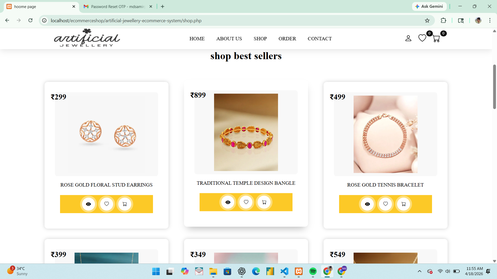
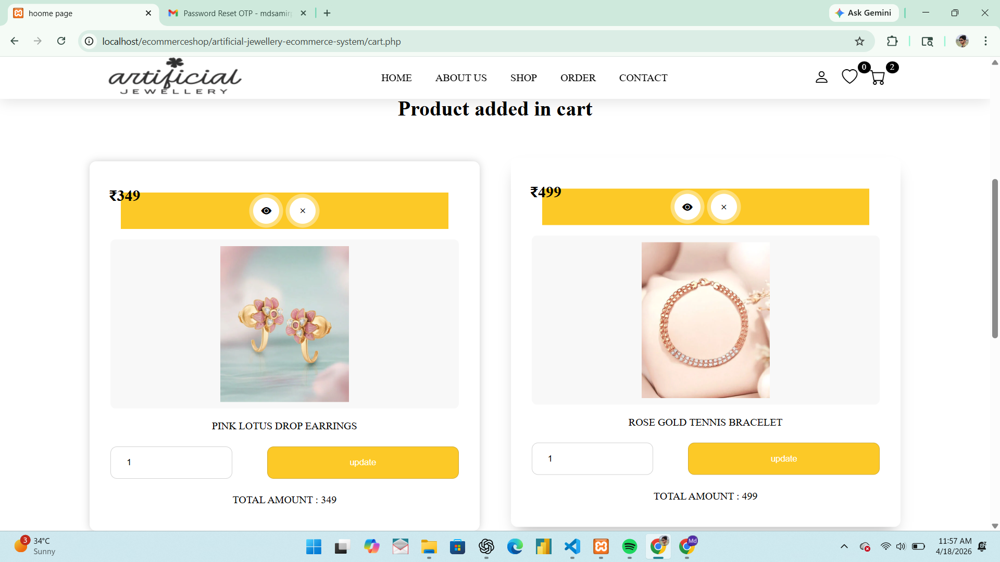
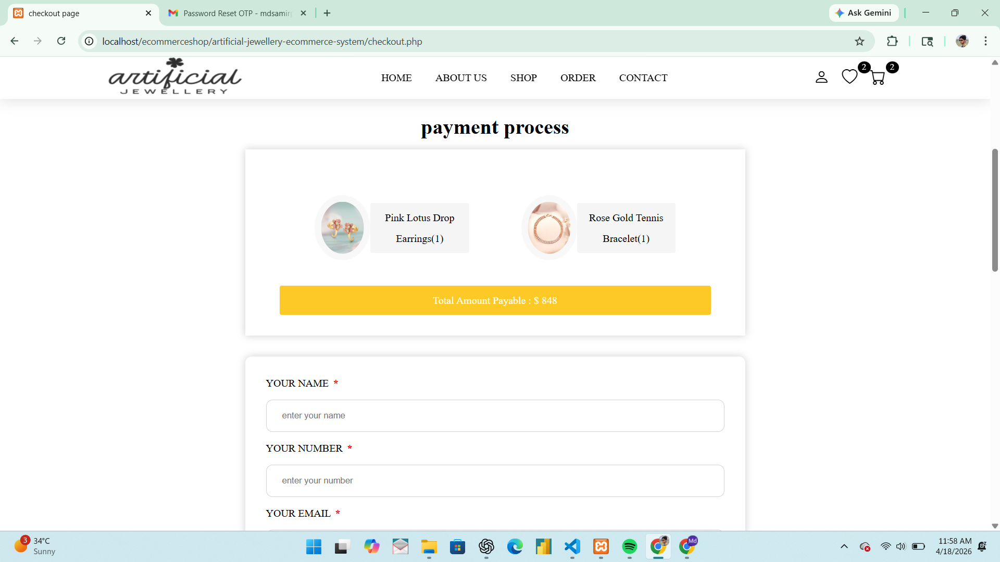
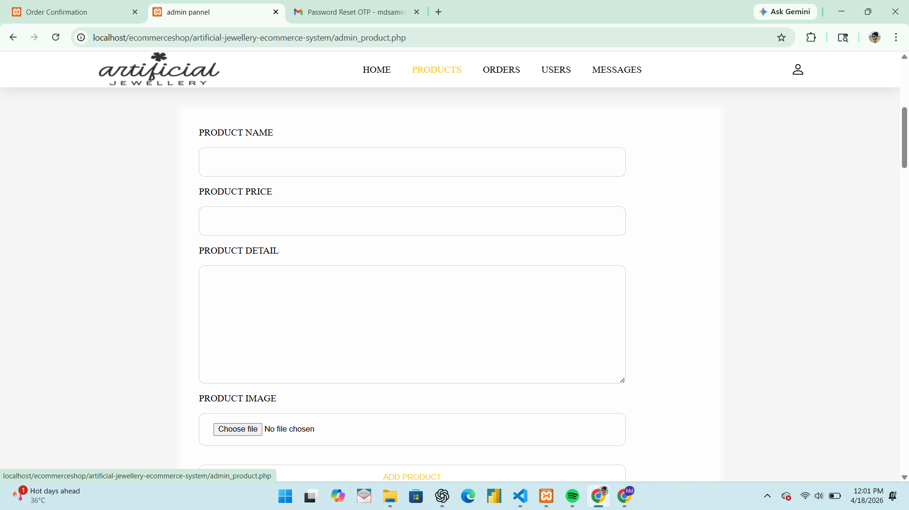
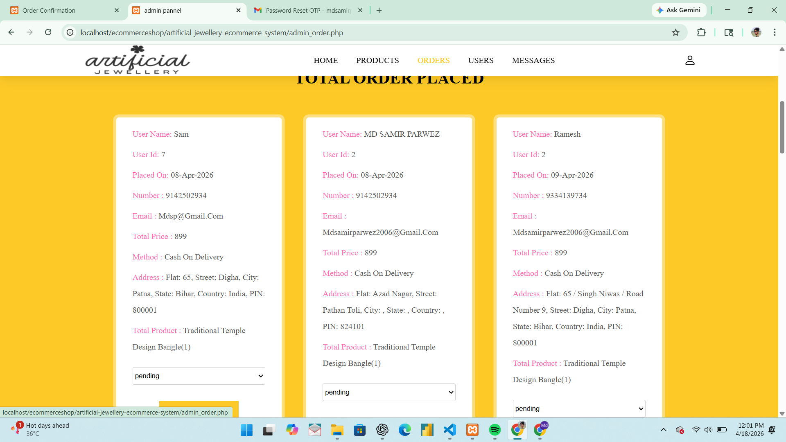
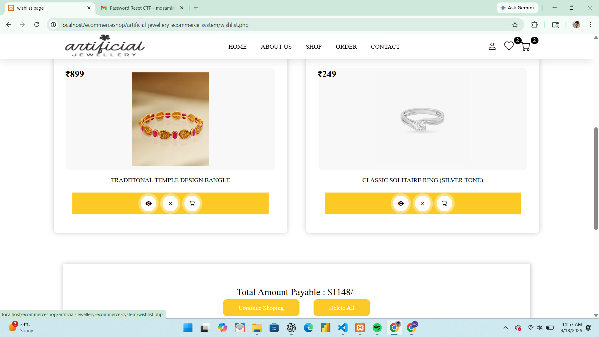
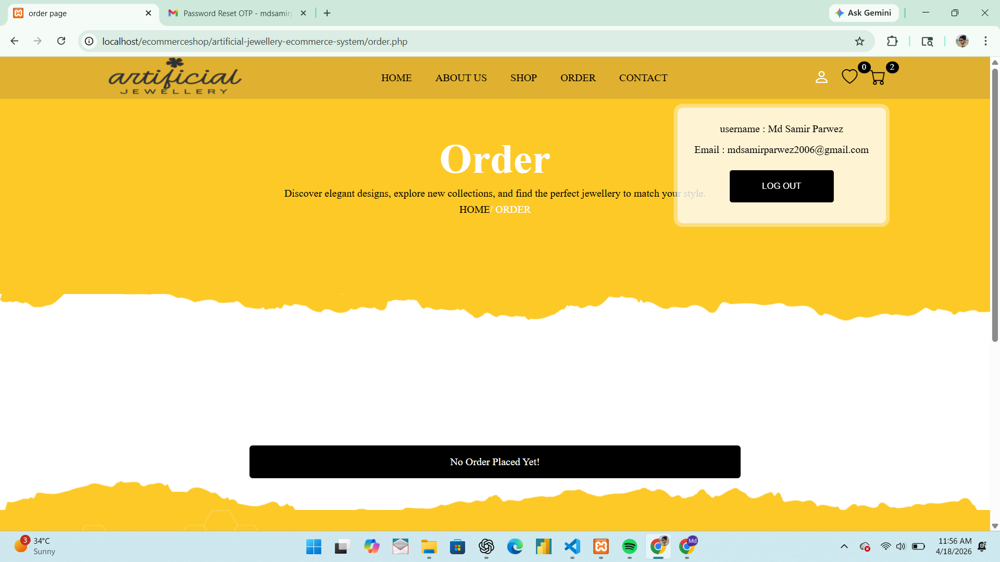
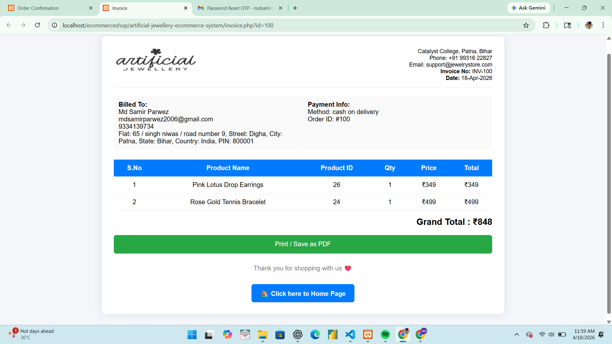

# 💎 Artificial Jewellery E-Commerce System

This is a web-based e-commerce application developed for selling artificial jewellery online. The project is built using HTML, CSS, JavaScript, PHP, and MySQL.

---

## 🎯 Project Objective

The main objective of this project is to develop an online platform for buying artificial jewellery with secure authentication, user-friendly interface, and efficient order management system.

---

## 👥 User Roles

### 👤 User
- Register/Login with OTP
- Browse products
- Add to cart & wishlist
- Place orders

### 👨‍💼 Admin
- Manage products
- Manage users
- View orders
- Dashboard analytics

---

## 🚀 Features

- 🔐 User Registration & Login System
- 📩 OTP Verification using PHPMailer (SMTP)
- 🛍️ Product Listing and Management (Admin Panel)
- 🛒 Add to Cart & Checkout System
- 📍 GPS Location Detection during Checkout
- ✅ Form Validation (Client-side & Server-side)
- 📦 Order Management System
- 📬 Contact Form with Email Integration

---

## 🔐 Security Features

- OTP-based email verification
- Password encryption
- Server-side validation
- Protection against invalid inputs

---

## 📸 Project Screenshots

### 🏠 Home Page


### 🔐 Login Page


### 🛍️ Shop Page


### 🛒 Cart Page


### 💳 Checkout Page


### 👨‍💼 Admin Dashboard


---

## 📁 All Screenshots

<details>
<summary>Click to view all screenshots</summary>

### 📄 Pages

  
  
  
  
  
  

### 👨‍💼 Admin Panel

  
  
  
  

### 🛒 Shopping Flow

  
  
  
  

</details>

---

## 🛠️ Technologies Used

- Frontend: HTML, CSS, JavaScript
- Backend: PHP
- Database: MySQL
- Mail Service: PHPMailer (SMTP)

---

## 📂 Project Structure
```
artificial-jewellery-ecommerce-system/
│── database/
│ └── shop_db.sql
│── image/
│── img/
│── PHPMailer-master/
│── about.php
│── admin_header.php
│── admin_message.php
│── admin_order.php
│── admin_pannel.php
│── admin_product.php
│── admin_user.php
│── cart.php
│── checkout.php
│── confirmation.php
│── connection.php
│── contact.php
│── download_orders.php
│── export_users.php
│── fetch_dashboard.php
│── footer.php
│── forgot_password.php
│── header.php
│── homeshop.php
│── index.php
│── invoice.php
│── login.php
│── main.css
│── new_password.php
│── order.php
│── register.php
│── script.js
│── script2.js
│── send_reset_otp.php
│── shop.php
│── style.css
│── update_password.php
│── update_qty.php
│── verify_register_otp.php
│── verify_reset_otp.php
│── view_page.php
│── wishlist.php
│── README.md
```

---

## ⚙️ Installation & Setup

1. Install XAMPP/WAMP
2. Copy project folder to:

C:/xampp/htdocs/

3. Open phpMyAdmin:

http://localhost/phpmyadmin

4. Create database:

shop_db

5. Import SQL file:

database/shop_db.sql

6. Start Apache & MySQL
7. Run project:

http://localhost/artificial-jewellery-ecommerce-system


---

## 📌 Special Features

### 🔐 OTP Authentication
- Email OTP verification during registration & password reset
- Implemented using PHPMailer SMTP

### 📍 GPS Location Detection
- Automatically fetches user's current location during checkout
- Helps in accurate delivery

### ✅ Form Validation
- JavaScript validation (Frontend)
- PHP validation (Backend)

---

## ⚠️ Known Issues

- GPS may not work on some browsers without permission
- SMTP setup required for OTP functionality

---

## 🌐 Future Enhancements

- Online payment integration (Razorpay/Stripe)
- Mobile app version
- Product review & rating system
- AI-based product recommendation

---

## 🤝 Contribution

Feel free to contribute or suggest improvements.

## ⭐ Feedback

If you like this project, give it a star ⭐ on GitHub.

---

## 👨‍💻 Author

**Md Samir Parwez**

---

## 📄 Note

This project is developed for educational purposes only.